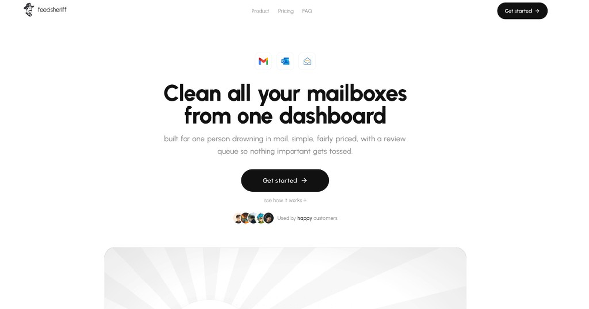

<div align="center">

<a href="https://feedsheriff.com">
  
</a>

# FeedSheriff MCP

**Inbox cleanup for AI agents.**
Let Claude, ChatGPT, Cursor, VS Code, and Codex clean Gmail, Outlook, and Zoho. Write filters in plain English, preview every cleanup, undo anything for 30 days.

[](https://feedsheriff.com)
[](https://feedsheriff.com/docs/mcp)
[](https://feedsheriff.com/app/settings?tab=agents)

[](LICENSE)
[](https://modelcontextprotocol.io)
[](https://feedsheriff.com/docs/mcp)
[](https://feedsheriff.com)
[](https://feedsheriff.com)
[](https://feedsheriff.com)

<br />

<a href="https://feedsheriff.com">
  
</a>

</div>

<br />

> This repo is the **plugin package**: MCP config, skills, and slash commands. The product runs at **`https://feedsheriff.com/mcp`**. Nothing here runs on your machine.

Paid **Solo** or **Multi** plan required. Cleanup is **off** unless you turn that scope on.

## Paste into your agent

Copy this into Claude, ChatGPT, Cursor, Codex, or any other agent. It will add the MCP server and walk you through OAuth.

```
Set up FeedSheriff MCP in this agent.

Server: https://feedsheriff.com/mcp (Streamable HTTP)
Docs: https://feedsheriff.com/docs/mcp
Plugin + skills: https://github.com/sarthakguptadev/feedsheriff-mcp
I have a paid Solo or Multi plan at feedsheriff.com.

1. Detect which client you are (Claude Code, Claude Desktop, ChatGPT, Codex, Cursor, VS Code, Windsurf, Gemini, or other).
2. Add the server with that client's native install. Prefer OAuth. Do not invent an API key.
3. If this client cannot do OAuth, tell me to create a key at https://feedsheriff.com/app/settings?tab=agents (starts with fs_live_) and wait for me to paste it.
4. For Claude Code also run:
   /plugin marketplace add sarthakguptadev/feedsheriff-mcp
   /plugin install feedsheriff-mcp@feedsheriff-mcp
5. Complete browser OAuth. Ask me to approve read, write, and cleanup if I want the agent to move mail.
6. Verify tools are listed. Confirm when done.
7. Never call start_cleanup without preview_cleanup first, and never before I confirm the counts.

If you can read URLs, follow https://feedsheriff.com/docs/mcp
```

## Install

Same server for every client: `https://feedsheriff.com/mcp`

**OAuth** (ChatGPT, Claude, VS Code, Codex, and most others): the client opens a browser. You pick `read`, `write`, and optionally `cleanup`.

**API key** (Cursor marketplace, scripts): create one in [Settings → AI Agents](https://feedsheriff.com/app/settings?tab=agents). Starts with `fs_live_`.

### Cursor

[](https://cursor.com/install-mcp?name=feedsheriff-mcp&config=eyJ1cmwiOiJodHRwczovL2ZlZWRzaGVyaWZmLmNvbS9tY3AifQ==)

Or add to `~/.cursor/mcp.json` (OAuth):

```json
{
  "mcpServers": {
    "feedsheriff-mcp": {
      "url": "https://feedsheriff.com/mcp"
    }
  }
}
```

Install this GitHub repo as a Cursor plugin to get the skills below, then paste an API key if the plugin asks.

### Claude Code

```bash
claude mcp add --transport http feedsheriff-mcp https://feedsheriff.com/mcp
```

Then `/mcp` and finish OAuth. For skills + slash commands:

```bash
/plugin marketplace add sarthakguptadev/feedsheriff-mcp
/plugin install feedsheriff-mcp@feedsheriff-mcp
```

### Claude Desktop / Claude.ai

Add a custom connector with URL `https://feedsheriff.com/mcp`, or put this in `claude_desktop_config.json`:

```json
{
  "mcpServers": {
    "feedsheriff-mcp": {
      "url": "https://feedsheriff.com/mcp"
    }
  }
}
```

Complete OAuth when prompted.

### ChatGPT

Settings → Apps & Connectors → add a custom MCP connector.

- Server URL: `https://feedsheriff.com/mcp`
- Auth: OAuth

Approve scopes in FeedSheriff. You need a ChatGPT plan that allows custom connectors.

### Codex

`~/.codex/config.toml`:

```toml
[mcp_servers.feedsheriff-mcp]
url = "https://feedsheriff.com/mcp"
```

Then:

```bash
codex mcp login feedsheriff-mcp
```

### VS Code (Copilot)

`.vscode/mcp.json`:

```json
{
  "servers": {
    "feedsheriff-mcp": {
      "type": "http",
      "url": "https://feedsheriff.com/mcp"
    }
  }
}
```

Command Palette → **MCP: List Servers** → start FeedSheriff → OAuth.

[](https://insiders.vscode.dev/redirect/mcp/install?name=feedsheriff-mcp&config=%7B%22type%22%3A%22http%22%2C%22url%22%3A%22https%3A//feedsheriff.com/mcp%22%7D)

### Windsurf

`~/.codeium/windsurf/mcp_config.json`:

```json
{
  "mcpServers": {
    "feedsheriff-mcp": {
      "serverUrl": "https://feedsheriff.com/mcp"
    }
  }
}
```

### Gemini / Antigravity

```json
{
  "mcpServers": {
    "feedsheriff-mcp": {
      "serverUrl": "https://feedsheriff.com/mcp"
    }
  }
}
```

### Any other MCP client

```json
{
  "mcpServers": {
    "feedsheriff-mcp": {
      "url": "https://feedsheriff.com/mcp"
    }
  }
}
```

If the client has no remote HTTP support:

```json
{
  "mcpServers": {
    "feedsheriff-mcp": {
      "command": "npx",
      "args": ["-y", "mcp-remote", "https://feedsheriff.com/mcp"]
    }
  }
}
```

API key instead of OAuth:

```json
{
  "mcpServers": {
    "feedsheriff-mcp": {
      "url": "https://feedsheriff.com/mcp",
      "headers": {
        "Authorization": "Bearer fs_live_YOUR_KEY"
      }
    }
  }
}
```

## Skills

These teach the agent how to use the tools. Same idea as Notion's plugin: MCP for access, skills for the workflow.

| Skill | When to use it |
|---|---|
| `inbox-status` | Plan, mailboxes, dashboard, live scans |
| `draft-filter` | Write, test, and save a filter in plain English |
| `inbox-cleanup` | Preview, then start a cleanup |
| `review-queue` | Keep or toss mail waiting in Review |
| `undo-cleanup` | Reverse a sweep or one action |

Claude Code slash commands: `/feedsheriff-mcp:status` `/feedsheriff-mcp:draft-filter` `/feedsheriff-mcp:cleanup` `/feedsheriff-mcp:review` `/feedsheriff-mcp:undo`

## What your agent can do

| | Tools |
|---|---|
| **Read** | `get_account` `list_mailboxes` `get_dashboard` `list_filters` `list_routines` `list_activity` `list_review_queue` `get_live_scans` |
| **Write** | `draft_filter` `test_filter` `create_filter` `update_filter` `delete_filter` `update_routine` `decide_review` |
| **Cleanup** | `preview_cleanup` `start_cleanup` `undo_action` `undo_scan` |

Try asking:

- "Draft a filter for cold sales pitches and test it on my inbox."
- "Preview a cleanup of my newsletters. How many emails would move?"
- "Show what's waiting in Review."
- "Undo the last cleanup."

## Safe by default

- **Preview first.** `start_cleanup` needs a short-lived confirm token from `preview_cleanup`.
- **Cleanup is opt-in.** It is a separate key or OAuth scope, off by default.
- **Starred and important mail is never moved.** Uncertain mail waits in Review.
- **Undo for 30 days.** Trash keeps mail 30 days, and every action can be reversed.
- **Email text is untrusted.** Sender and subject in tool output are marked so models don't follow instructions hidden in mail.
- **No mail password.** Inboxes connect through Google, Microsoft, or Zoho sign-in.

## Auth

| Method | Use it for |
|---|---|
| **OAuth 2.1** (dynamic client registration, PKCE) | ChatGPT, Claude, VS Code, Codex, Windsurf, Gemini |
| **API key** `fs_live_…` | Cursor plugin, scripts, anything that sends a Bearer header |

Metadata: [`/.well-known/oauth-protected-resource`](https://feedsheriff.com/.well-known/oauth-protected-resource) · [`/.well-known/oauth-authorization-server`](https://feedsheriff.com/.well-known/oauth-authorization-server)

## What's in this repo

```
.
├── plugin.json            Agent Plugins manifest (Cursor)
├── mcp.json               Hosted MCP server + API key variable
├── .cursor-plugin/        Cursor plugin manifest
├── .claude-plugin/        Claude Code plugin + marketplace manifest
├── .mcp.json              Claude Code MCP config (OAuth)
├── skills/                How the agent should use each workflow
├── commands/              Claude Code slash commands
└── assets/                Logo and banner
```

## Links

[Website](https://feedsheriff.com) · [MCP docs](https://feedsheriff.com/docs/mcp) · [Privacy](https://feedsheriff.com/privacy) · [Terms](https://feedsheriff.com/terms) · [Pricing](https://feedsheriff.com/#pricing) · [X @sarthakguptadev](https://x.com/sarthakguptadev) · [sarthak@feedsheriff.com](mailto:sarthak@feedsheriff.com)

## License

MIT for this plugin package. FeedSheriff the product is a hosted service.
